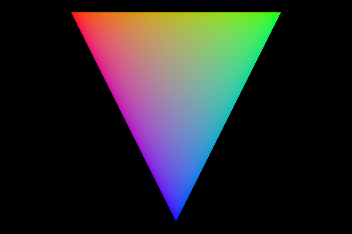

Creating a graphics engine using the Vulkan API.

Finally got the whale over the plane. I used two descriptor sets, one with a vector of model matrices for each model
in the scene (whale and plane), and the other with the view and projection matrices which are constant
across models. vkCmdBindDescriptorSets is then called when rendering each model, where the offset parameter
is updated so that the appropriate model matrix from the vector of matrices in the respective UBO is bound.

Support for multiple models. Next step is to have different descriptor sets to give each model its own ubo (so I can move the whale on top of the plane.).

First triangle!:

