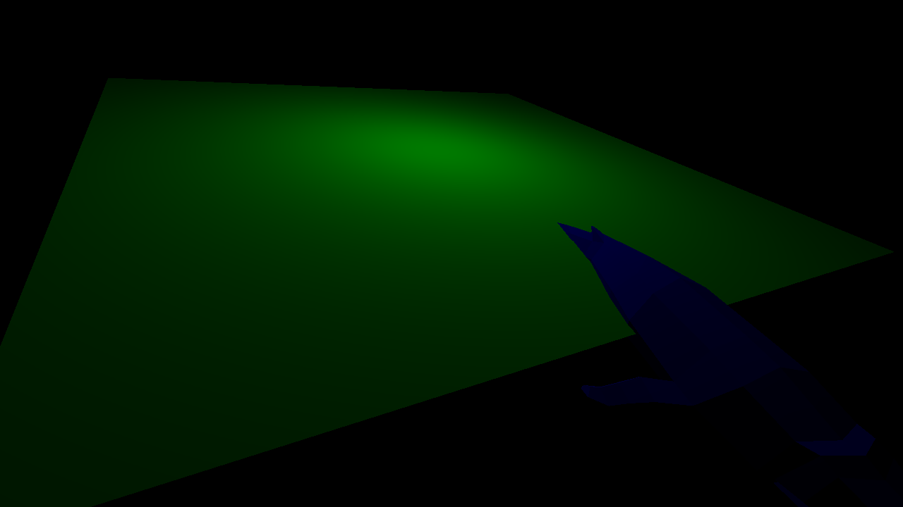

Creating a graphics engine using the Vulkan API.

I'm wondering what the best way to render more than 1 model is.
Here I only have a single vertex and index buffer, and then
just offset the indices by the length of the vertex buffer each time
I add a new object. But now, I want to transform the whale
and not the plane, so I need to have different
descriptor sets when accessing differnet locations in the index buffer.

First triangle!:

